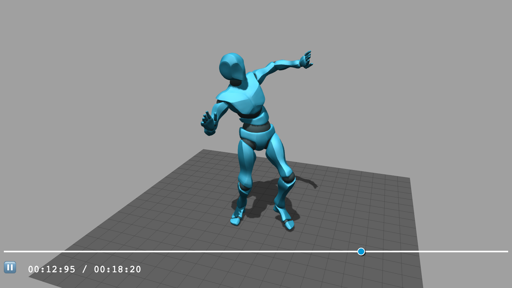

# fbx-animation-controls

[](https://badge.fury.io/js/fbx-animation-controls)
[](https://www.npmjs.com/package/fbx-animation-controls)
[](https://bundlephobia.com/package/fbx-animation-controls)
[](https://github.com/itsdorosh/fbx-animation-controls/blob/master/LICENSE)
[](https://github.com/itsdorosh/fbx-animation-controls/stargazers)

The easiest way to control FBX animations with Three.js (almost 😇).

Provides time management, animation control, mesh attachment, **multiple animation selection**, and HTML-based controls for FBX animations in Three.js applications.



---

## ✨ Features

- 🎮 **Full animation playback control** - Play, pause, stop, and scrub through animations
- 🎯 **Multiple animation support** - Select and switch between different animation tracks
- ⏱️ **Precise time management** - Set exact time positions and percentages
- 🎨 **Customizable HTML controls** - Built-in UI with full styling control
- 📡 **Rich event system** - Listen to animation state changes and track switching
- 🔧 **TypeScript support** - Full type definitions included
- 📱 **Responsive design** - Works on desktop and mobile devices

## 🚀 Installation

```bash
npm install fbx-animation-controls --save
```

## 📖 Quick Start

### Basic Usage

```js
import { FBXAnimationControls } from 'fbx-animation-controls';

const controls = new FBXAnimationControls(document.getElementById('viewer'));

// Attach an FBX mesh with animations
controls.attach(mesh, { play: true });

// In your render loop:
function animate() {
    controls.update();
    // ... your other render code
    requestAnimationFrame(animate);
}
```

### Multiple Animation Support

```js
// Attach mesh with multiple animations
controls.attach(mesh);

// Get list of available animations
const animations = controls.getAnimationList();
console.log('Available animations:', animations.map(anim => anim.name));

// Select animation by index
controls.selectAnimation(1);

// Or select by name
controls.selectAnimationByName('Run');

// Listen for animation changes
controls.on('ANIMATION_TRACK_CHANGED', (data) => {
    console.log(`Switched from ${data.previousIndex} to ${data.currentIndex}`);
    console.log(`Now playing: ${data.animationInfo.name}`);
});
```

### Advanced Configuration

```js
const config = {
    outputFormat: 'MM_SS_MS',           // Time format: MM:SS:MS or SS:MS
    initHTMLControls: true,             // Enable built-in UI controls
    enableAnimationSelector: true,      // Show animation dropdown
    autoSelectFirstAnimation: true     // Auto-select first animation on attach
};

const controls = new FBXAnimationControls(container, config);
```

## 📋 API Reference

### Properties

- `attachedMesh: Mesh | null` - Currently attached Three.js mesh
- `isPlaying: boolean` - Whether animation is currently playing
- `isPaused: boolean` - Whether animation is paused
- `isStopped: boolean` - Whether animation is stopped
- `isHTMLControlsAvailable: boolean` - Whether HTML controls are initialized

#### New Animation Selector Properties

- `availableAnimations: IAnimationTrackInfo[]` - List of all available animations
- `currentAnimationIndex: number` - Index of currently selected animation (-1 if none)
- `currentAnimationTrack: IAnimationTrackInfo | null` - Info about current animation
- `hasMultipleAnimations: boolean` - Whether multiple animations are available
- `isAnimationSelectorEnabled: boolean` - Whether animation selector is enabled

### Core Methods

#### `attach(mesh: Mesh, attachOptions?: IAttachOptions): void`

Attach a Three.js mesh with FBX animations.

**Parameters:**

- `mesh` - Three.js Mesh object with animations
- `attachOptions` - Optional configuration object
  - `play?: boolean` - Auto-play animation after attachment
  - `atTime?: string | number` - Start time for the animation
  - `animationIndex?: number` - **NEW**: Initial animation to select (0-based index)

**Example:**

```js
// Attach and start playing the second animation
controls.attach(mesh, { 
    play: true, 
    animationIndex: 1,
    atTime: 2.5 
});
```

#### `detach(): void`

Detach the current mesh and reset controls.

#### Animation Playback

- `play(): void` - Start playing the current animation
- `pause(): void` - Pause the animation at current time
- `stop(): void` - Stop the animation and reset to beginning
- `setTime(time: string | number): void` - Set the current animation time
- `setPercentage(percentage: number): void` - Set animation progress as percentage (0-100)

#### `update(): void`

Update the animation mixer. **Call this in your render loop!**

### New Animation Selection Methods

#### `selectAnimation(index: number): IAnimationTrackInfo`

Select an animation by its zero-based index.

**Example:**

```js
// Select the first animation
const selectedAnimation = controls.selectAnimation(0);
console.log(`Selected: ${selectedAnimation.name} (${selectedAnimation.duration}s)`);
```

#### `selectAnimationByName(name: string): IAnimationTrackInfo`

Select an animation by its name.

**Example:**

```js
try {
    const animation = controls.selectAnimationByName('Walk');
    console.log(`Selected walk animation: ${animation.duration}s`);
} catch (error) {
    console.error('Animation not found:', error.message);
}
```

#### `getAnimationList(): IAnimationTrackInfo[]`

Get a list of all available animations.

**Example:**

```js
const animations = controls.getAnimationList();
animations.forEach((anim, index) => {
    console.log(`${index}: ${anim.name} - ${anim.duration}s (${anim.tracks} tracks)`);
});
```

#### `getAnimationByIndex(index: number): IAnimationTrackInfo | null`

Get animation information by index.

#### `getAnimationByName(name: string): IAnimationTrackInfo | null`

Get animation information by name.

### Utility Methods

#### `getCurrentAnimationTimeDisplayString(): string`

Get formatted string of current animation time.

#### `on(eventName: string, callback: (data?: any) => void): void`

Subscribe to animation events.

### Static Methods

#### `FBXAnimationControls.getAnimationTimeDisplayString(time: number, format: string): string`

Convert time in seconds to formatted display string.

#### `FBXAnimationControls.getAnimationTrackInfo(clip: AnimationClip, index: number): IAnimationTrackInfo`

Extract information from a Three.js AnimationClip.

### Configuration

```ts
interface IControlsConfiguration {
    outputFormat?: OutputTimeFormats;      // Time display format
    initHTMLControls?: boolean;            // Whether to create HTML controls
    enableAnimationSelector?: boolean;     // NEW: Show animation dropdown
    autoSelectFirstAnimation?: boolean;    // NEW: Auto-select first animation
}

interface IAttachOptions {
    play?: boolean;                        // Auto-play after attachment
    atTime?: string | number;              // Start time
    animationIndex?: number;               // NEW: Initial animation index
}

interface IAnimationTrackInfo {
    index: number;                         // Zero-based animation index
    name: string;                          // Animation name
    duration: number;                      // Duration in seconds
    tracks: number;                        // Number of animation tracks
    uuid: string;                          // Unique identifier
}

enum OutputTimeFormats {
    MM_SS_MS = 'MM_SS_MS',  // 01:23:45 format
    SS_MS = 'SS_MS'         // 23:45 format
}
```

## 🎯 Event System

Subscribe to events to get notified of animation state changes:

```js
// Basic playback events
controls.on('PLAY', () => console.log('Animation started'));
controls.on('PAUSE', () => console.log('Animation paused'));
controls.on('STOP', () => console.log('Animation stopped'));

// Mesh events
controls.on('MESH_ATTACHED', () => console.log('Mesh attached'));
controls.on('MESH_DETACHED', () => console.log('Mesh detached'));

// Time/progress events
controls.on('CHANGE_PERCENTAGE', (percentage) => console.log('Progress:', percentage));
controls.on('CHANGE_TIME', (time) => console.log('Time:', time));

// NEW: Animation selection events
controls.on('ANIMATION_SELECTED', (data) => {
    console.log('Animation selected:', data.animationInfo.name);
    console.log('Current index:', data.currentIndex);
});

controls.on('ANIMATION_TRACK_CHANGED', (data) => {
    console.log(`Switched from animation ${data.previousIndex} to ${data.currentIndex}`);
    console.log(`Now playing: ${data.animationInfo.name}`);
    console.log(`Duration: ${data.animationInfo.duration}s`);
});
```

**Available Events:**

### Basic Events

- `PLAY` - Animation started
- `PAUSE` - Animation paused  
- `STOP` - Animation stopped
- `MESH_ATTACHED` - Mesh attached to controls
- `MESH_DETACHED` - Mesh detached from controls
- `CHANGE_PERCENTAGE` - Animation progress changed
- `CHANGE_TIME` - Animation time changed

### New Animation Selection Events

- `ANIMATION_SELECTED` - Fired when an animation is selected (including initial selection)
  - `data.animationInfo` - Information about the selected animation
  - `data.currentIndex` - Index of the selected animation
  - `data.previousIndex` - Previous animation index (-1 if none)

- `ANIMATION_TRACK_CHANGED` - Fired when switching between different animations
  - `data.animationInfo` - Information about the new animation
  - `data.currentIndex` - Index of the new animation
  - `data.previousIndex` - Index of the previous animation

## 🎨 Styling

### Option 1: Use Default Styles

Add to your HTML file:

```html
<link rel="stylesheet" href="./node_modules/fbx-animation-controls/src/themes/default.css" />
```

### Option 2: Custom Styles

Style these CSS selectors according to your design:

**Main Container:**

- `.animationControlsContainer` - Main controls container
- `.mainControlsContainer` - Container for play controls and slider

**Animation Selector (NEW):**

- `.animationSelectorContainer` - Container for animation selection UI
- `.animationSelectorLabel` - Label for the dropdown ("Track:")
- `.animationSelector` - The dropdown/select element
- `.animationInfoDisplay` - Information display (tracks count, duration)

**Playback Controls:**

- `.animationSlider` - Range input slider
- `.playButton` - Play/pause button
- `.currentAnimationTime` - Time display text

**Slider Styling (cross-browser):**

- `.animationSlider::-webkit-slider-runnable-track` (WebKit)
- `.animationSlider::-moz-range-track` (Firefox)
- `.animationSlider::-ms-track` (IE/Edge)

**Slider Thumb (cross-browser):**

- `.animationSlider::-webkit-slider-thumb` (WebKit)
- `.animationSlider::-moz-range-thumb` (Firefox)
- `.animationSlider::-ms-thumb` (IE/Edge)

### Custom Styling Example

```css
/* Hide animation selector if not needed */
.animationSelectorContainer {
    display: none;
}

/* Custom dropdown styling */
.animationSelector {
    background: #333;
    color: white;
    border: 1px solid #555;
    border-radius: 4px;
    padding: 4px 8px;
}

/* Custom info display */
.animationInfoDisplay {
    font-size: 10px;
    color: #999;
    font-style: italic;
}
```

## � Complete Examples

### Basic Single Animation

```js
import { FBXAnimationControls } from 'fbx-animation-controls';

const controls = new FBXAnimationControls(document.getElementById('viewer'));

// Load and attach FBX with single animation
controls.attach(mesh, { play: true });

function animate() {
    controls.update();
    renderer.render(scene, camera);
    requestAnimationFrame(animate);
}
animate();
```

### Multiple Animations with Selection

```js
import { FBXAnimationControls } from 'fbx-animation-controls';

const controls = new FBXAnimationControls(document.getElementById('viewer'), {
    enableAnimationSelector: true,
    autoSelectFirstAnimation: true
});

// Attach mesh with multiple animations
controls.attach(mesh);

// Log available animations
const animations = controls.getAnimationList();
console.log('Available animations:');
animations.forEach((anim, i) => {
    console.log(`${i}: ${anim.name} (${anim.duration}s, ${anim.tracks} tracks)`);
});

// Set up event listeners
controls.on('ANIMATION_TRACK_CHANGED', (data) => {
    console.log(`Switched to: ${data.animationInfo.name}`);
    updateUI(data.animationInfo);
});

// Programmatically switch animations
document.getElementById('walk-btn').addEventListener('click', () => {
    controls.selectAnimationByName('Walk');
});

document.getElementById('run-btn').addEventListener('click', () => {
    controls.selectAnimationByName('Run');
});

function animate() {
    controls.update();
    renderer.render(scene, camera);
    requestAnimationFrame(animate);
}
animate();
```

### Custom Animation Manager

```js
class CharacterController {
    constructor(mesh, container) {
        this.controls = new FBXAnimationControls(container, {
            enableAnimationSelector: false,  // Disable built-in selector
            autoSelectFirstAnimation: false
        });
        
        this.controls.attach(mesh);
        this.setupAnimations();
    }
    
    setupAnimations() {
        const animations = this.controls.getAnimationList();
        this.animationMap = new Map();
        
        animations.forEach(anim => {
            // Map animation names to indices for quick access
            this.animationMap.set(anim.name.toLowerCase(), anim.index);
        });
        
        // Set up automatic transitions
        this.controls.on('ANIMATION_TRACK_CHANGED', (data) => {
            this.onAnimationChanged(data.animationInfo);
        });
    }
    
    // High-level animation methods
    walk() { 
        return this.playAnimation('walk'); 
    }
    
    run() { 
        return this.playAnimation('run'); 
    }
    
    jump() { 
        return this.playAnimation('jump'); 
    }
    
    playAnimation(name) {
        const index = this.animationMap.get(name.toLowerCase());
        if (index !== undefined) {
            this.controls.selectAnimation(index);
            this.controls.play();
            return true;
        }
        console.warn(`Animation "${name}" not found`);
        return false;
    }
    
    onAnimationChanged(animationInfo) {
        console.log(`Character now playing: ${animationInfo.name}`);
        // Add custom logic here (e.g., sound effects, UI updates)
    }
    
    update() {
        this.controls.update();
    }
}

// Usage
const character = new CharacterController(fbxMesh, document.getElementById('controls'));

// Simple API
character.walk();
setTimeout(() => character.run(), 2000);
setTimeout(() => character.jump(), 4000);

function animate() {
    character.update();
    renderer.render(scene, camera);
    requestAnimationFrame(animate);
}
animate();
```

### TypeScript Example

```ts
import { 
    FBXAnimationControls, 
    IControlsConfiguration, 
    IAttachOptions,
    IAnimationTrackInfo,
    EventTypes 
} from 'fbx-animation-controls';

const config: IControlsConfiguration = {
    outputFormat: 'MM_SS_MS',
    initHTMLControls: true,
    enableAnimationSelector: true,
    autoSelectFirstAnimation: true
};

const controls = new FBXAnimationControls(
    document.getElementById('viewer')!, 
    config
);

const attachOptions: IAttachOptions = {
    play: false,
    animationIndex: 1  // Start with second animation
};

controls.attach(mesh, attachOptions);

// Type-safe event handling
controls.on(EventTypes.ANIMATION_TRACK_CHANGED, (data) => {
    const animInfo: IAnimationTrackInfo = data.animationInfo;
    console.log(`Animation: ${animInfo.name}, Duration: ${animInfo.duration}s`);
});

// Get animation info with type safety
const currentTrack: IAnimationTrackInfo | null = controls.currentAnimationTrack;
if (currentTrack) {
    console.log(`Current: ${currentTrack.name}`);
}
```

## 🔄 Migration from v1.x to v2.x

The new animation selector feature is **fully backwards compatible**. Existing code will continue to work without changes.

### What's New

- **Multiple animation support** - Automatically detects and lists all animations
- **Animation selection API** - Select animations by index or name
- **Enhanced events** - New events for animation switching
- **Improved UI** - Optional dropdown selector for animation switching
- **Better TypeScript support** - Comprehensive type definitions

### Optional Upgrades

```js
// Old way (still works)
controls.attach(mesh, { play: true });

// New way (recommended for multiple animations)
controls.attach(mesh, { 
    play: true,
    animationIndex: 1  // Start with specific animation
});

// Access multiple animations
const animations = controls.getAnimationList();
controls.selectAnimationByName('Run');
```

### Configuration Updates

```js
// Old configuration (still works)
const controls = new FBXAnimationControls(container, {
    outputFormat: 'MM_SS_MS',
    initHTMLControls: true
});

// New configuration options
const controls = new FBXAnimationControls(container, {
    outputFormat: 'MM_SS_MS',
    initHTMLControls: true,
    enableAnimationSelector: true,     // NEW: Show animation dropdown
    autoSelectFirstAnimation: true     // NEW: Auto-select first animation
});
```

## � Development

```bash
# Install dependencies
npm install

# Run tests
npm test

# Run tests with coverage
npm run test:coverage

# Lint code
npm run lint

# Format code  
npm run format

# Check everything
npm run check
```

## 🤝 Contributing

Issues and pull requests are welcome! Please feel free to:

- Report bugs
- Request new features  
- Submit improvements
- Add more examples
- Improve documentation

## 📄 License

MIT

## 🙏 Acknowledgments

- Three.js team for the amazing 3D library
- FBX format support in Three.js
- Community feedback and contributions
